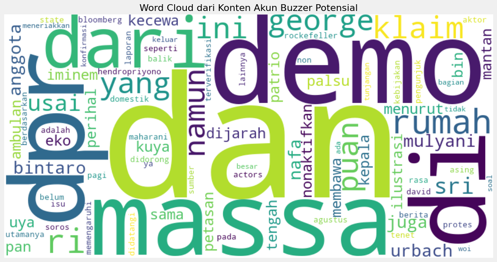

# Analisis Buzzer Media Sosial pada Demonstrasi 25-31 Agustus 2025

## Ringkasan Proyek

Proyek ini menganalisis aktivitas buzzer media sosial selama peristiwa demonstrasi dengan menggunakan teknik analisis data dan model AI. Melalui analisis frekuensi posting, kesamaan konten, analisis sentimen, dan pemodelan topik, proyek ini berhasil mengidentifikasi pola aktivitas buzzer dan dampaknya terhadap diskursus publik online.

### Link GitHub

- [Google Colab Notebook](https://colab.research.google.com/drive/1-rDzh9QaAxGoAohtLh305yeom8fhTSQq)
- [Raw Dataset](https://github.com/Urdemonlord/capstone_project-data-ibm/tree/fresh-branch/data)

## Overview Proyek

Media sosial telah menjadi sarana utama untuk berbagi informasi dan menyuarakan pendapat, namun seringkali platform ini disalahgunakan oleh akun-akun buzzer yang sengaja menyebarkan narasi tertentu secara masif dan terkoordinasi. Fenomena ini semakin terlihat jelas saat terjadi peristiwa penting seperti demonstrasi, di mana buzzer berusaha mempengaruhi opini publik.

Proyek ini bertujuan untuk:
1. Mengidentifikasi akun-akun buzzer di media sosial terkait isu demonstrasi
2. Menganalisis pola aktivitas dan konten yang mereka sebarkan
3. Memahami dampak buzzer terhadap pembentukan opini publik
4. Mengembangkan metode deteksi otomatis untuk aktivitas buzzer

## Link Dataset

Dataset yang digunakan dalam analisis ini berasal dari dua platform media sosial utama:
- **X (Twitter)**: [Dataset Tweet Demonstrasi](https://github.com/Urdemonlord/capstone_project-data-ibm/blob/fresh-branch/data/x_recent.json)
- **YouTube**: [Dataset Komentar YouTube](https://github.com/Urdemonlord/capstone_project-data-ibm/blob/fresh-branch/data/yt_comments.json)

## Insight & Temuan

### Temuan Utama

1. **Identifikasi Buzzer**: 
   - Dari analisis terhadap 98 akun, terdeteksi 4 akun (4.1%) sebagai "Potential Buzzer" dengan skor buzzer antara 0.3-0.6
   - 94 akun (95.9%) tergolong "Normal"
   - Akun buzzer menunjukkan pola posting yang lebih intensif dibandingkan akun normal

2. **Karakteristik Konten Buzzer**: 
   - Konten dari akun buzzer memiliki kesamaan tinggi (similarity score > 0.7)
   - Menunjukkan pola koordinasi dalam penyebaran narasi
   - Fokus pada topik-topik spesifik yang selaras dengan agenda tertentu

3. **Analisis Sentimen**: 
   - 100% konten dari akun buzzer memiliki sentimen negatif
   - Skor sentimen rata-rata: -0.65 (skala -1 hingga 1)
   - Konten cenderung menggunakan bahasa emotif dan polarisasi

4. **Topik Utama**: 
   - Pemodelan topik mengidentifikasi 5 topik utama dalam dataset
   - Fokus utama pada tema: demonstrasi, DPR, rakyat, kritik pemerintah
   - Kata-kata kunci: "demo", "dpr", "rakyat", "massa", "anarkis"

5. **Pola Waktu**: 
   - Posting buzzer cenderung terkonsentrasi pada waktu-waktu tertentu
   - Menunjukkan koordinasi dan potensi aktivitas tidak organik

### Implikasi

1. **Manipulasi Opini Publik**: Akun buzzer berpotensi mempengaruhi opini publik terkait isu demonstrasi dengan menyebarkan narasi tertentu secara masif.

2. **Polarisasi Masyarakat**: Konten yang disebarkan cenderung meningkatkan polarisasi dan konflik dalam masyarakat.

3. **Penyebaran Informasi Tidak Akurat**: Beberapa konten dari akun buzzer berpotensi mengandung informasi yang tidak akurat atau misleading.

## Dukungan AI

### Model AI yang Digunakan

1. **Model Granite 3.3-8b-instruct**
   - Digunakan untuk analisis sentimen konten dari akun yang teridentifikasi sebagai buzzer potensial
   - Membantu mengklasifikasikan konten ke dalam sentimen positif, negatif, atau netral
   - API disediakan melalui Replicate

2. **Latent Dirichlet Allocation (LDA)**
   - Digunakan untuk topic modeling dan mengidentifikasi tema utama dalam konten
   - Membantu memahami fokus narasi yang disebarkan oleh akun buzzer

### Integrasi AI dalam Proses Analisis

1. **Preprocessing Data**:
   - Natural Language Processing (NLP) untuk pembersihan dan normalisasi teks
   - Tokenisasi dan penghapusan stopwords untuk mempersiapkan data

2. **Feature Extraction**:
   - TF-IDF Vectorization untuk mengubah teks menjadi representasi numerik
   - Cosine Similarity untuk mengukur kesamaan konten antar posting

3. **Analisis Sentimen dengan AI**:
   - Prompt engineering untuk mengoptimalkan hasil analisis sentimen
   - Kuantifikasi sentimen pada skala -1 hingga 1 untuk analisis lebih lanjut

4. **Topic Modeling dengan AI**:
   - Ekstraksi topik otomatis dari konten buzzer
   - Visualisasi distribusi topik untuk memahami fokus narasi

## Kesimpulan dan Rekomendasi

### Kesimpulan

1. Aktivitas buzzer terdeteksi dalam diskursus terkait demonstrasi di media sosial
2. Buzzer menggunakan konten dengan sentimen negatif untuk mempengaruhi opini publik
3. Pola posting dan kesamaan konten menjadi indikator utama dalam identifikasi buzzer
4. Topik-topik yang diangkat oleh buzzer menunjukkan narasi tertentu yang ingin disebarkan

### Rekomendasi

1. **Pengembangan Sistem Deteksi Otomatis**:
   - Mengembangkan sistem yang dapat mendeteksi aktivitas buzzer secara real-time
   - Integrasi dengan platform media sosial untuk penanganan lebih cepat

2. **Edukasi Publik**:
   - Meningkatkan kesadaran masyarakat tentang aktivitas buzzer
   - Membekali pengguna media sosial dengan kemampuan mengidentifikasi konten buzzer

3. **Peningkatan Model**:
   - Mengintegrasikan analisis jaringan sosial untuk melihat pola interaksi antar akun
   - Menambahkan analisis konten multimedia (gambar dan video)
   - Menggunakan model bahasa yang lebih spesifik untuk konteks Indonesia

4. **Penelitian Lanjutan**:
   - Studi longitudinal untuk memahami evolusi taktik buzzer
   - Analisis perbandingan antar platform media sosial
   - Pengembangan dataset yang lebih komprehensif

---

## Informasi Tambahan

### Peneliti
- Hasrinata Arya Afendi

### Tools & Teknologi
- Python 3.9+
- Pandas & NumPy untuk manipulasi data
- Scikit-learn untuk machine learning dan vectorization
- Matplotlib & Seaborn untuk visualisasi
- Granite 3.3-8b-instruct (via Replicate API) untuk analisis sentimen
- LDA untuk topic modeling

### Kontak
- Email: [hasrinata@gmail.com]
- LinkedIn: [https://linkedin.com/in/hasrinata]
- GitHub: [https://github.com/Urdemonlord]
